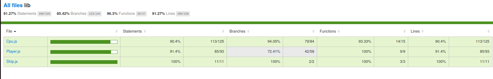

# Report for Assignment 1 resit

## Project chosen

Name: Battleship-Cli

URL: https://github.com/no-stack-dub-sack/battleship-cli/tree/master

Number of lines of code and the tool used to count it: 364950, counted with lizard

Programming language: JavaScript

## Coverage measurement with existing tool

For coverage measurement, Jest was utilized. Here's how it was executed:

    Tool Used: Jest
    Execution Method: Jest was executed through the npm test script defined in package.json. This script runs all the test suites and automatically generates coverage reports.

Below is a screenshot illustrating the coverage summary generated by Jest before any improvements were implemented:

And now a screenshot illustrating the coverage summary generated by Jest after the implementation of the improvements:

## Coverage improvement

### Individual tests

<populateShips>

#### populateShips()

Link towards the commit where I added the test file Player.populateShips.test.js :
    [text](https://github.com/alexandra-velicu/battleship-cli/commit/af20041052612553b56cc07148596db97f976fc5#diff-33ce59dd712d5f856444a8170b363990b2c0071c0632bf429fd304d5824506cc)

Because I am using jest as a coverage tool, in order to find the coverage percentage of a function I have to use the coverage percentage formula:

Coverage Percentage = (Number of Covered Lines / Total Number of Lines) * 100 

- **Number of Covered Lines**: Number of lines in the code that have been executed by the test suite.
- **Total Number of Lines**: Total number of lines in the function or file being measured for coverage.

Bellow is a screenshot of the function in the html coverage report I generated (for better readability) before (left) and after (right) the improvements I made. The red lines signify uncovered lines:

As it can be seen all lines have been covered after creating the test file Player.populateShips.test.js.

Coverage Percentage = (6 / 6) * 100 = 100%

- **Coverage Improvement**: Improved from 0% to 100%.
- **Elaboration**: Initially, `populateShips` had no tests covering its functionality. By adding tests that now cover every line of the function, we ensure that ship initialization is thoroughly validated. This improvement helps prevent potential bugs related to ship setup in the game.

<fireTorpedo>

#### fireTorpedo()

Link towards the commit where I added the test file Player.fireTorpedo.test.js :
    [text](https://github.com/alexandra-velicu/battleship-cli/commit/af20041052612553b56cc07148596db97f976fc5#diff-3175f134d8b3fcf00519b950e154b60cad1432a08fc54cca853b219607e285a6)

Link towards the commit where I added a few more tests to Player.fireTorpedo.test.js :
    [text](https://github.com/alexandra-velicu/battleship-cli/commit/31ad9e1dd4e8dd887030afbba1321a9c17a72a79#diff-3175f134d8b3fcf00519b950e154b60cad1432a08fc54cca853b219607e285a6)

Bellow is a screenshot of the function in the html coverage report I generated before (left) and after (right) the improvements I made. The red lines signify uncovered lines:

As it can be seen all lines have been covered after creating the test file Player.fireTorpedo.test.js.
Coverage Percentage = (11 / 11) * 100 = 100%

- **Coverage Improvement**: Improved from 0% to 100%.
- **Elaboration**: Initially, `fireTorpedo` had no test coverage, leaving its behavior unvalidated. By implementing dedicated test cases that cover each possible outcome (miss, repeat, hit), we now ensure that the function correctly updates the game board and provides accurate messages.

<updateShip>

#### updateShip

Link towards the commit where I added the test file Player.updateShip.test.js :
    [text](https://github.com/alexandra-velicu/battleship-cli/commit/af20041052612553b56cc07148596db97f976fc5#diff-f291394c88943fa179bbf84b4e317c307870690034f3dd3d17043195df23144a)

Bellow is a screenshot of the function in the html coverage report I generated before (left) and after (right) the improvements I made. The red lines signify uncovered lines:

As it can be seen all lines have been covered after creating the test file Player.updateShip.test.js.

Coverage Percentage = (14 / 14) * 100 = 100%

- **Coverage Improvement**: Increased from 0% to 100%.
- **Elaboration**: Initially, the `updateShip` function had no test coverage, leaving its behavior unverified. With the addition of a specific test case that verifies ship hit increments and sinking, we now validate the function's ability to update ship states accurately. Additionally, this test seems to cover the `increment` function found in Ship.js

<updateBoard>

#### updateBoard()

Link towards the commit where I added the test file Player.updateBoard.test.js :
    [text](https://github.com/alexandra-velicu/battleship-cli/commit/af20041052612553b56cc07148596db97f976fc5#diff-bda112455bec1178acb0fbce83d43a6734e3a7481abf39d71a939adc8ad7c6c1)

Bellow is a screenshot of the function in the html coverage report I generated before (left) and after (right) the improvements I made. The red lines signify uncovered lines:

As it can be seen all lines have been covered after creating the test file Player.updateBoard.test.js.

Coverage Percentage = (3 / 3) * 100 = 100%

- **Coverage Improvement**: Increased from 0% to 100%.
- **Elaboration**: Before testing, `updateBoard` lacked verification, risking errors. Now, tests confirm it correctly updates both player and opponent boards, ensuring reliable gameplay.

<validateInstruction>

#### validateInstruction()

Link towards the commit where I added the test file Player.validateInstruction.test.js :
    [text](https://github.com/alexandra-velicu/battleship-cli/commit/af20041052612553b56cc07148596db97f976fc5#diff-4afe09605f8a3675d55aefcdd6078a812dc14850e4daf874e518305274bb4fcc)

Bellow is a screenshot of the function in the html coverage report I generated before (left) and after (right) the improvements I made. The red lines signify uncovered lines:

As it can be seen after creating the test file Player.updateBoard.test.js almost all lines are covered with the exeption of 2 lines

Coverage Percentage = (8 / 11) * 100 = 81.82%

- **Coverage Improvement**: Increased from 0% to 81.82%.
- **Elaboration**: Previously, `validateInstruction` didn't have coverage for handling errors related to invalid coordinates and duplicate ship placements. Although improved, specific lines addressing these errors remain uncovered. Additional tests will be necessary to achieve complete coverage for all validation paths.

We can also look into the file clover.xml generated after running the coverage report, in which there are stated how many methods(functions) of a file are covered. I made a test file for every function in Player.js, so looking at the clover.xml file before the improvements we can clearly see that only one method was covered:

And after I added my test files, we can see that all methods are covered:

<State the coverage improvement with a number and elaborate on why the coverage is improved>

### Overall

Old coverage: 
    terminal: 
    html: 

New coverage: 
    terminal: 
    html: 
